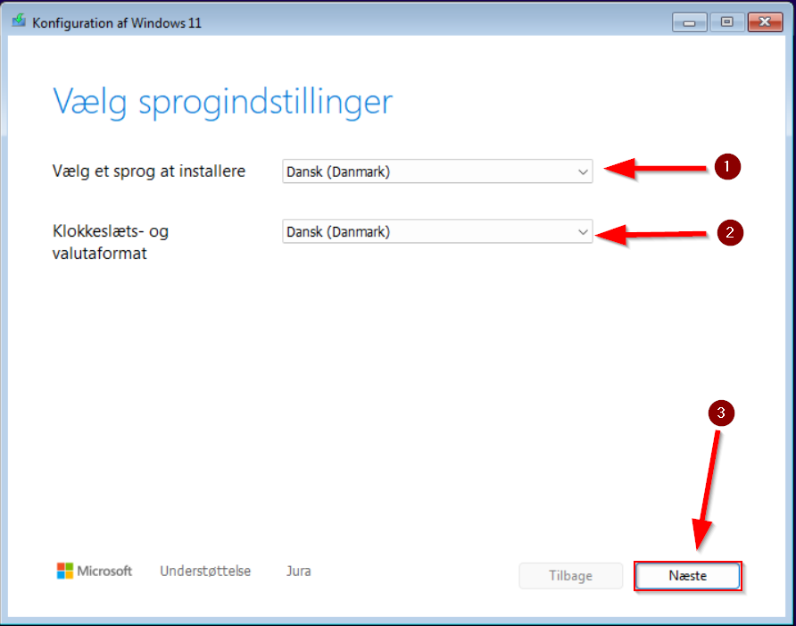
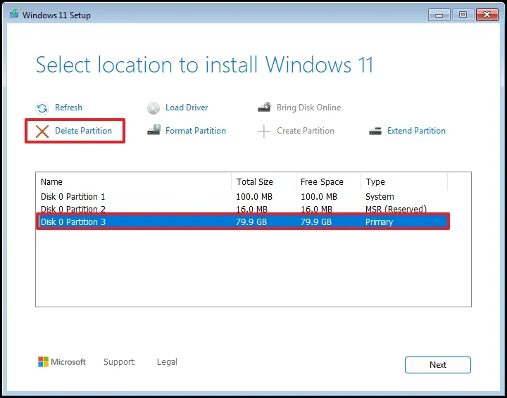
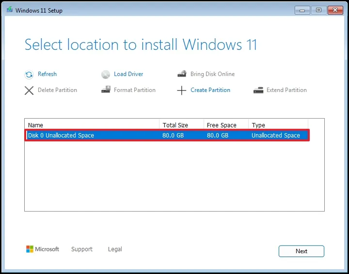

# Windows 11 Hybrid Azure AD Join + Intune Enrollment Guide

> Audience: IT personnel preparing and enrolling a new (or repurposed) Windows 11 laptop into On-Prem Active Directory (AD) and Microsoft Intune (Hybrid Azure AD Join scenario).
>
> Goal: Clean install Windows 11, join on-prem AD, enable Hybrid Azure AD Join, register device in Intune, and verify compliance.

---

## Table of Contents

- [Windows 11 Hybrid Azure AD Join + Intune Enrollment Guide](#windows-11-hybrid-azure-ad-join--intune-enrollment-guide)
  - [Table of Contents](#table-of-contents)
  - [Prerequisites Checklist](#prerequisites-checklist)
  - [Prepare Installation Media](#prepare-installation-media)
  - [Clean Install Windows 11](#clean-install-windows-11)

---

## Prerequisites Checklist

| Item                  | Description                                                           | Verified |
| --------------------- | --------------------------------------------------------------------- | -------- |
| Installation USB      | Latest Windows 11 image (22H2/23H2 or newer)                          | ☐        |
| Network Access        | Able to reach Domain Controllers + Internet + Azure endpoints         | ☐        |
| Domain Credentials    | AD account with rights to join computers (or delegated OU permission) | ☐        |
| Device Object Cleanup | Old computer account for same hostname removed/disabled               | ☐        |
| AD Connect Sync       | Azure AD Connect running & healthy (Hybrid Join enabled)              | ☐        |
| Intune Licensing      | User has appropriate Intune / EMS / M365 license                      | ☐        |
| GPO / SCP Config      | Service Connection Point (SCP) configured for Hybrid Join             | ☐        |
| Naming Convention     | Decide final computer name (if not auto-generated)                    | ☐        |

> Tip: Print or export this checklist before going onsite.

---

## Prepare Installation Media

1. Download latest Windows 11 ISO from official source (VLSC / MS Endpoint / MS Download).
2. Use the Media Creation Tool or Rufus (GPT + UEFI) to create a bootable USB.
3. Safely eject and label it clearly.

---

## Clean Install Windows 11

Boot from the Windows 11 USB. Follow the language/region prompts.

When you reach the partition selection screen:

1. Select each existing OS / data partition and click **Delete** until only **Unallocated space** remains.
2. DO NOT delete:
   - Your USB installation media
   - OEM recovery partitions (if you intentionally want to keep them)
3. You should end with one line: **Drive 0 Unallocated Space**.

Select the unallocated space and click **Next**.

Windows will now copy files, install features, and reboot several times. No action needed until the Out-of-Box Experience (OOBE) reappears.

---
